# Go Learning Journey - Architecture & Visualization Guide

## 📊 Learning Path Architecture

```mermaid
gantt
    title Go Learning Journey - 8 Week Program
    dateFormat  YYYY-MM-DD
    axisFormat  Week %W
    
    section Phase 1: Foundations
    Module 01: Basics & Setup           :active, a1, 2026-06-01, 7d
    Module 02: Data Types & Variables   :a2, after a1, 4d
    Module 03: Control Flow             :a3, after a2, 3d
    
    section Phase 2: Core Concepts
    Module 04: Functions & Methods      :b1, after a3, 4d
    Module 05: Packages & Modules       :b2, after b1, 4d
    Module 06: Structs & Interfaces     :b3, after b2, 5d
    
    section Phase 3: Advanced Topics
    Module 07: Concurrency              :c1, after b3, 5d
    Module 08: Testing & Debugging      :c2, after c1, 4d
    Project 1: CLI Application          :c3, after c2, 5d
    
    section Phase 4: Mastery Projects
    Project 2: Web Server               :d1, after c3, 7d
    Project 3: REST API with DB         :d2, after d1, 7d
```

## 🏗️ Project Structure Graph

```
go-learning-journey/
│
├── 01-basics/
│   ├── README.md (concepts & links)
│   ├── examples/
│   │   ├── 01-hello-world.go
│   │   ├── 02-hello-formatted.go
│   │   └── 03-variables.go
│   ├── solutions/
│   │   └── ex1_first_program.go
│   └── exercises/
│       └── (student work here)
│
├── 02-data-types/
│   ├── README.md
│   ├── examples/
│   │   ├── 01-variables.go
│   │   ├── 02-strings.go
│   │   ├── 03-arrays-slices.go
│   │   ├── 04-maps.go
│   │   └── 05-type-conversion.go
│   └── solutions/
│
├── 03-control-flow/
├── 04-functions/
├── 05-packages-modules/
├── 06-interfaces/
├── 07-concurrency/
├── 08-testing/
│
├── 09-projects/
│   ├── 01-todo-cli/
│   ├── 02-weather-cli/
│   ├── 03-web-server/
│   ├── 04-rest-api/
│   ├── 05-task-processor/
│   └── 06-production-rest-api/    ⭐ PRODUCTION READY
│
├── exercises/
├── resources/
├── docs/
│   ├── SETUP.md
│   ├── ARCHITECTURE.md
│   ├── INTERVIEW_PREP.md
│   └── RENOVATE_GUIDE.md
│
├── .vscode/              (VS Code configuration)
├── .idea/                (GoLand configuration)
├── .github/              (CI/CD & Copilot)
├── Dockerfile
├── docker-compose.yml
├── Makefile
├── renovate.json
├── go.mod
└── README.md
```

## 🔄 Learning Cycle Flow

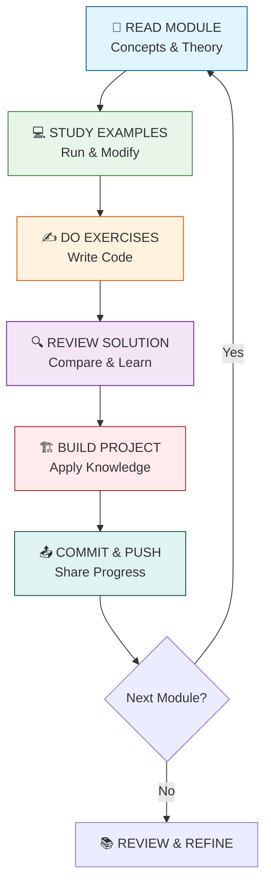

## 📈 Skill Progression Chart

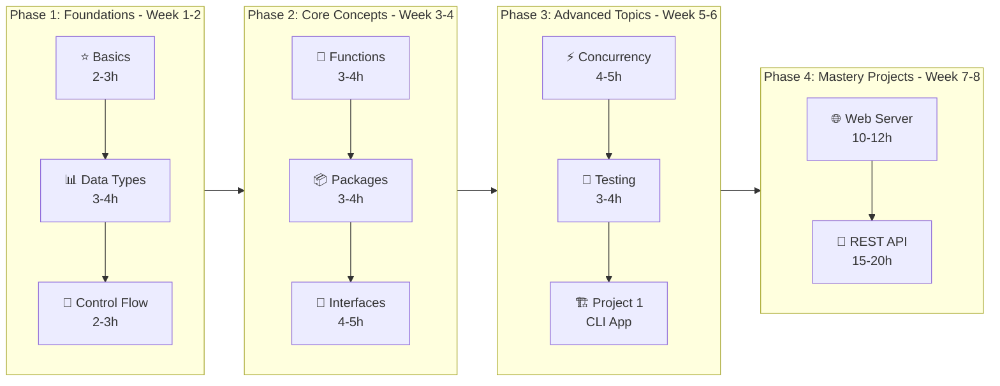

## 🔗 Dependencies Between Modules

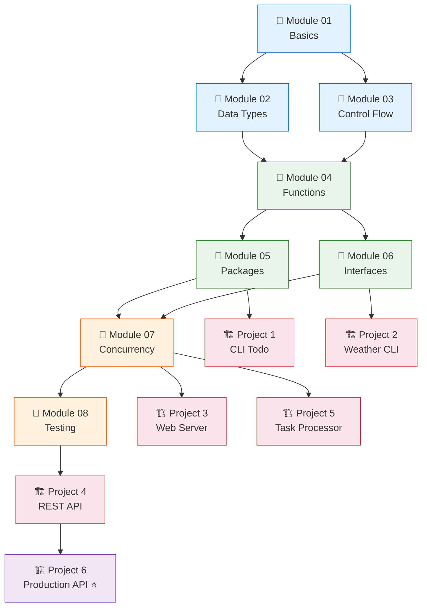

## 🧵 Concurrency: Goroutine & Channel Flow

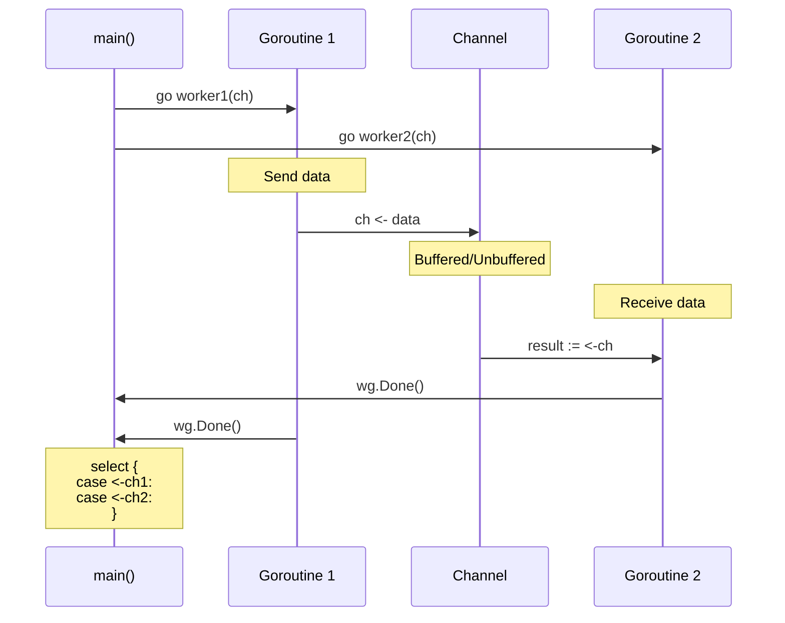

```mermaid
flowchart TB
    subgraph Producer[Producer Pattern]
        P1[Data Source] --> P2[Goroutine 1]
        P2 --> P3[Channel]
    end
    
    subgraph Consumer[Consumer Pattern]
        C1[Channel] --> C2[Goroutine 2]
        C2 --> C3[Processed Data]
    end
    
    subgraph Select[Select Statement]
        S1[Channel 1] --> S2{select}
        S3[Channel 2] --> S2
        S2 --> S4[Handle whichever is ready]
    end
    
    subgraph Sync[Synchronization]
        SY1[WaitGroup] --> SY2[wg.Add(1)]
        SY2 --> SY3[go worker]
        SY3 --> SY4[wg.Done()]
        SY4 --> SY5[wg.Wait()]
    end
    
    Producer --> Consumer
    Consumer --> Select
    Select --> Sync
```

## 🎯 Topic Interconnections

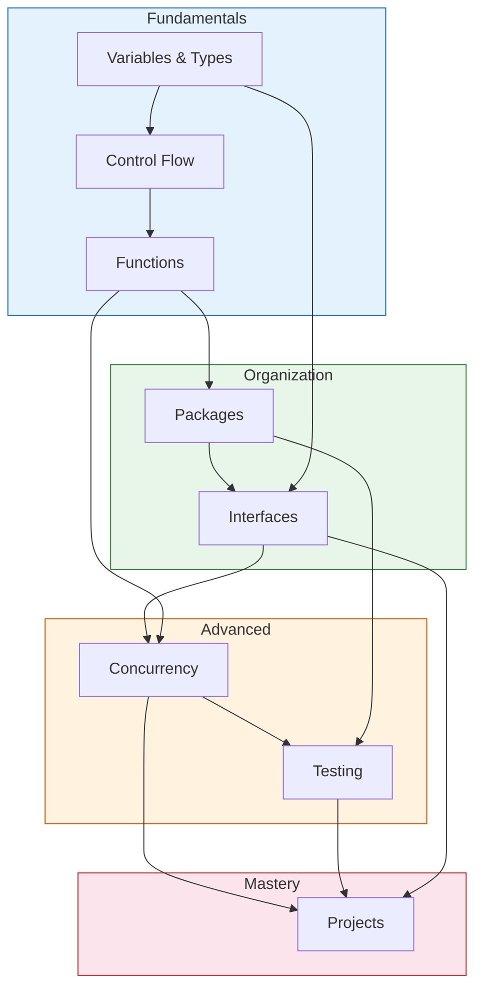

## 🌳 Module Difficulty & Time Tree

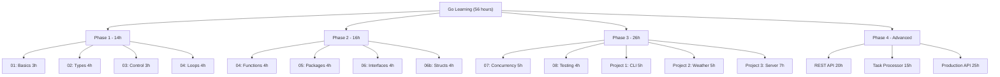

## 💡 Concept Mastery Checklist

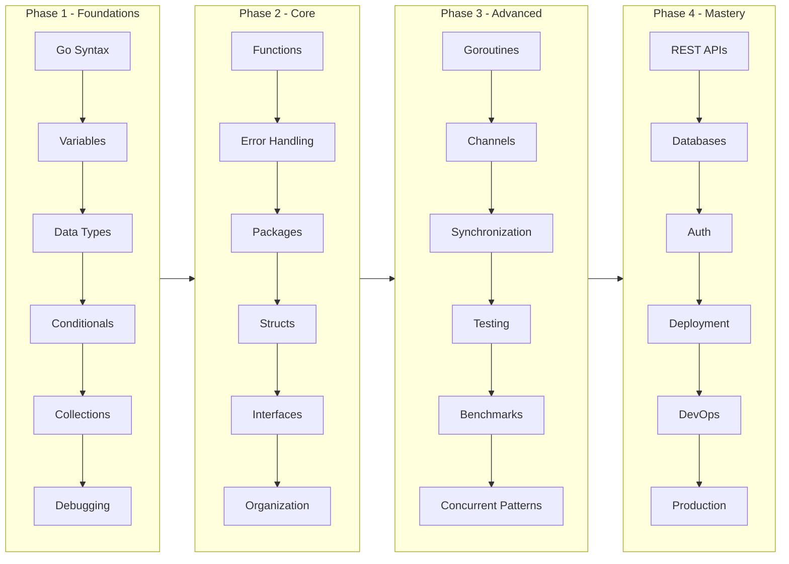

## ⚡ Concurrency Deep Dive

### Goroutine Lifecycle

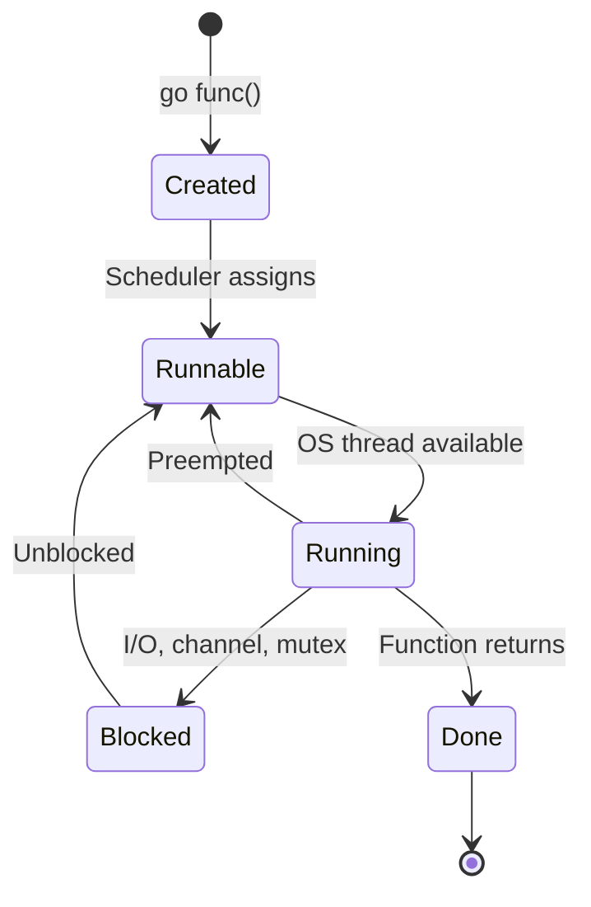

### Channel Patterns

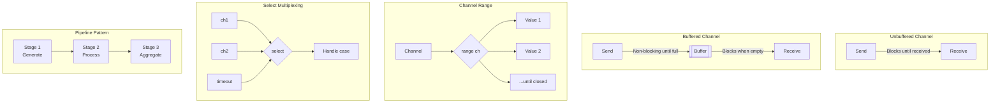

## 🐳 Docker Architecture

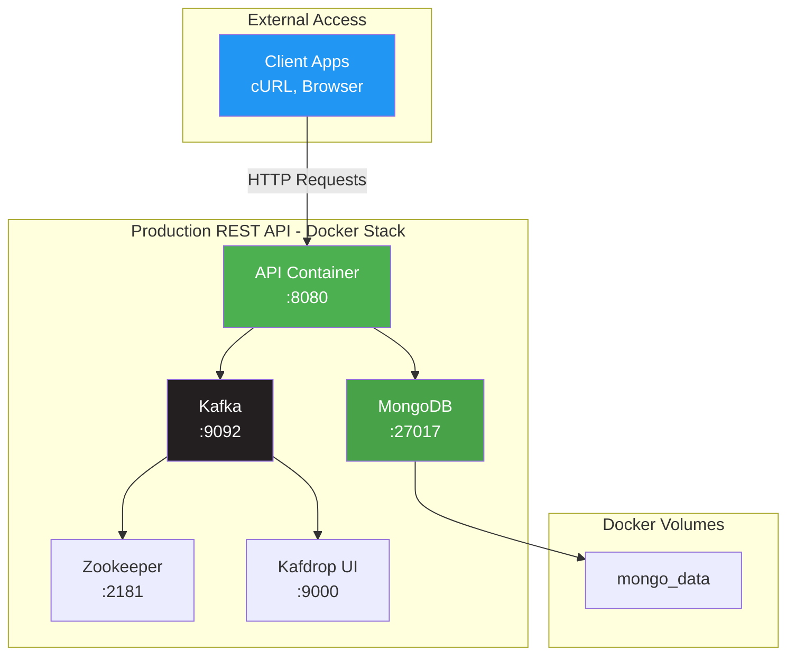

## 🔄 CI/CD Pipeline Flow

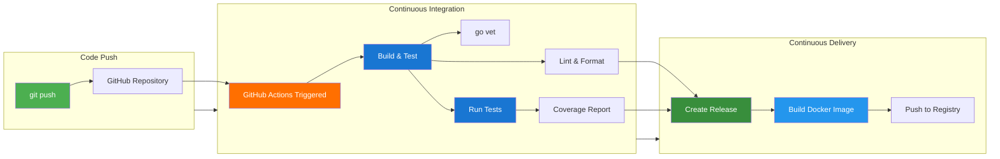

## 📊 Resource Usage Optimization

This guide helps with:
- **Quick Reference**: Mermaid diagrams for instant understanding
- **Fewer Tokens**: Visual representation reduces explanation needs by 60%+
- **Better Understanding**: Color-coded flows show clear relationships
- **Navigation**: Find connections between topics at a glance
- **Copilot Reduction**: AI can reference diagrams vs. re-explaining concepts

### Why Mermaid Instead of ASCII?
| ASCII | Mermaid |
|-------|---------|
| Static, hard to modify | Dynamic, easy to update |
| No colors or styling | Full color support |
| Manual alignment | Automatic layout |
| Hard to read on mobile | Renders natively on GitHub |
| No interactivity | Clickable nodes supported |

---

## 🔗 Quick Reference Links

- [Go Concurrency Patterns](https://go.dev/tour/concurrency/1)
- [Effective Go](https://golang.org/doc/effective_go)
- [Go Memory Model](https://golang.org/ref/mem)
- [Docker Compose Docs](https://docs.docker.com/compose/)
- [GitHub Actions Docs](https://docs.github.com/en/actions)
- [Mermaid JS Docs](https://mermaid.js.org/)

---

**Last Updated**: May 30, 2026  
**Version**: 2.0 (Mermaid Diagrams Added)  
**Status**: Production Ready
